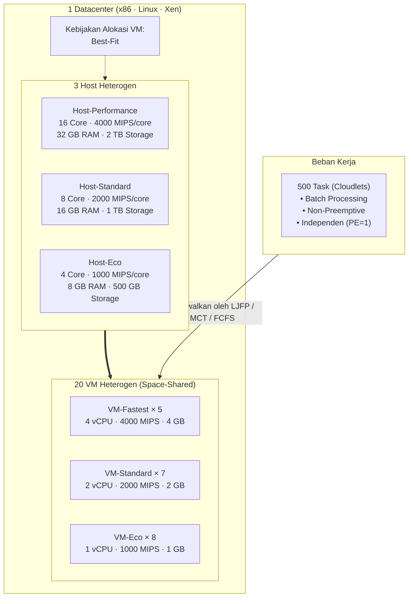
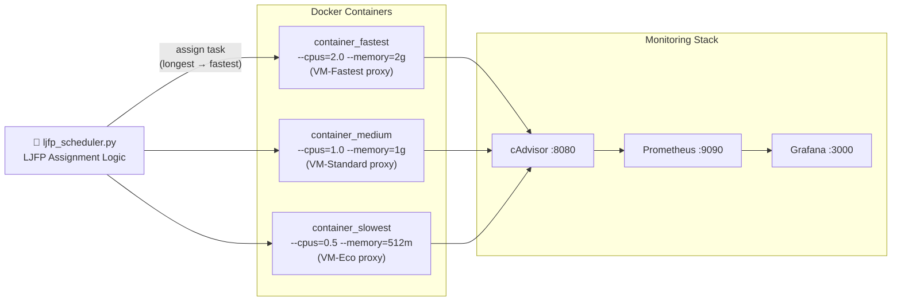

<h1 align="center">LJFP Algorithm</h1>
<h2 align="center">Strategi Optimasi Komputasi Awan (SOKA) 2026</h2>
<h3 align="center"><em>Optimasi Penjadwalan Task Menggunakan Algoritma LJFP (Longest Job to Fastest Processor)</em></h3>
<h4 align="center">Departemen Teknologi Informasi Institut Teknologi Sepuluh Nopember (ITS)</h4>

<p align="center">
  
  
  
  
  
  
</p>

---

## Anggota Kelompok 6

| No. | Nama Mahasiswa | NRP | Jobdesk |
| :---: | :--- | :---: | :--- |
| 1 | Ivan Syarifuddin | 5027241045 | - |
| 2 | Reza Aziz Simatupang | 5027241051 | - |
| 3 | Nisrina Bilqis | 5027241054 | - |
| 4 | Ananda Widi Alrafi | 5027241067 | - |
| 5 | Muhammad Khosyi Syehab | 5027241089 | Architecture Design & Algorithm Simulation |

---

## Daftar Isi

- [1. Pendahuluan](#1-pendahuluan)
- [2. Arsitektur Datacenter](#2-arsitektur-datacenter)
- [3. Implementasi Algoritma](#3-implementasi-algoritma)
- [4. Dataset Uji Coba](#4-dataset-uji-coba)
- [5. Hasil Simulasi](#5-hasil-simulasi)
- [6. Implementasi Real-World](#6-implementasi-real-world)
- [7. Panduan Menjalankan](#7-panduan-menjalankan)
- [8. Struktur Direktori](#8-struktur-direktori)
- [9. Referensi](#9-referensi)

---

## 1. Pendahuluan

### 1.1 Latar Belakang

Penjadwalan task pada lingkungan cloud heterogen adalah tantangan kritis dalam komputasi awan modern. Ketika beban kerja memiliki disparitas ukuran yang sangat tinggi (beberapa task berukuran 1.000 MI, sementara yang lain mencapai 900.000 MI), algoritma penjadwalan naif seperti FCFS akan menghasilkan ketimpangan beban yang parah task besar terjebak di VM lambat, menciptakan bottleneck yang menaikkan makespan secara drastis.

### 1.2 Solusi: Algoritma LJFP

**LJFP (Longest Job to Fastest Processor)** adalah algoritma heuristik *list scheduling* yang secara eksplisit menyelesaikan masalah ini:

> *"Jika ada task raksasa, pastikan ia dikerjakan oleh prosesor terkencang bukan terjebak mengantri di VM lambat."*

Prinsip kerja LJFP dalam 2 langkah:
1. **Sort**: Urutkan semua task secara **descending** berdasarkan panjang instruksi (MI) task terpanjang diprioritaskan.
2. **Assign**: Untuk setiap task (dari terpanjang ke terpendek), pilih VM yang menghasilkan **Estimated Completion Time (ECT) terkecil** secara greedy.

```
Perbedaan LJFP vs MCT:
  MCT  = greedy min-ECT, TANPA sorting
  LJFP = greedy min-ECT, DENGAN pre-sorting descending by length  ← kunci
```

---

## 2. Arsitektur Datacenter

Simulasi dibangun di **CloudSim Plus 8.0.0** sesuai Draft Desain Project Kelompok 6.



### Spesifikasi Host

| Kelas Host | Cores | MIPS/Core | RAM | Storage | Idle Power | Max Power |
|:---:|:---:|:---:|:---:|:---:|:---:|:---:|
| Host-Performance | 16 | 4.000 | 32 GB | 2 TB | 140 W | 300 W |
| Host-Standard | 8 | 2.000 | 16 GB | 1 TB | 105 W | 175 W |
| Host-Eco | 4 | 1.000 | 8 GB | 500 GB | 93.7 W | 135 W |

### Spesifikasi VM

| Tipe VM | Jumlah | vCPU | MIPS/vCPU | RAM | Target LJFP |
|:---:|:---:|:---:|:---:|:---:|:---|
| VM-Fastest | 5 | 4 | 4.000 | 4 GB | Top 20% task terberat |
| VM-Standard | 7 | 2 | 2.000 | 2 GB | Beban kerja menengah |
| VM-Eco | 8 | 1 | 1.000 | 1 GB | Beban kerja teringan |

> **Catatan RAM**: Total VM RAM = 5×4 + 7×2 + 8×1 = **42 GB** < 56 GB total host RAM ✓

---

## 3. Implementasi Algoritma

### 3.1 LJFP Algoritma Utama

**File**: [`src/main/java/com/kelompok6/LjfpBroker.java`](src/main/java/com/kelompok6/LjfpBroker.java)

```java
// Pseudocode LJFP
void schedule(tasks, vms) {
    // Step 1: Sort DESCENDING by Length (Longest Job First)
    tasks.sort(by length, descending);

    // Step 2: Greedy assignment min ECT
    Map<vmId, readyTime> = init 0.0 for all VMs;

    for each task in tasks:
        for each vm in vms:
            start  = max(task.arrivalTime, vm.readyTime)
            exec   = task.length / vm.mips
            ECT    = start + exec
        bestVm = vm with min ECT
        task.assignTo(bestVm)
        bestVm.readyTime = ECT
}
```

**Kompleksitas**: O(N log N) sorting + O(N × M) assignment, N=task, M=VM.

### 3.2 MCT Baseline 1

**File**: [`src/main/java/com/kelompok6/MctBroker.java`](src/main/java/com/kelompok6/MctBroker.java)

Identik dengan LJFP tetapi **tanpa pre-sorting**. Task diproses dalam urutan waktu kedatangan. Ini menjadikan MCT sebagai *fair baseline* logika assignment sama, hanya urutan input yang berbeda.

### 3.3 FCFS Baseline 2

**File**: [`src/main/java/com/kelompok6/FcfsBroker.java`](src/main/java/com/kelompok6/FcfsBroker.java)

Round-robin assignment berdasarkan urutan kedatangan. Tidak ada prediksi beban sama sekali. Disertakan untuk memperlebar kontras dan memperkuat signifikansi keunggulan LJFP.

### 3.4 Batasan Sistem (Constraints)

1. **Resource Capacity Constraint**: Task hanya dialokasikan ke VM dengan resource mencukupi.
2. **Non-Preemptive**: Task yang sudah mulai tidak dapat diinterupsi.
3. **Task Independence**: Tidak ada dependensi antar task.
4. **Strict Heterogeneity**: Spesifikasi VM sengaja sangat timpang.
5. **Exclusive Assignment**: Setiap task dipetakan ke tepat 1 VM.

---

## 4. Dataset Uji Coba

### 4.1 Dataset Sintetis Distribusi Weibull (Skenario 1)

**Script**: [`generate_dataset.py`](generate_dataset.py)

| Parameter | Nilai |
|:---|:---:|
| Jumlah Task | 500 |
| Distribusi | Weibull shape=0.8 (highly skewed) |
| Rentang Length | 1.000 – 900.000 MI |
| Mean | ~105.536 MI |
| PE Requirement | 1 (semua independen) |

Distribusi Weibull dengan shape < 1 menghasilkan banyak task kecil dan sedikit task raksasa kondisi ideal untuk menguji LJFP.

### 4.2 Dataset Log-Normal GoCJ Proxy (Skenario 2)

**Script**: [`preprocess_gocj.py`](preprocess_gocj.py)

| Parameter | Nilai |
|:---|:---:|
| Jumlah Task | 500 |
| Distribusi | Log-Normal (μ=10, σ=2) |
| Rentang Length | 1.000 – 900.000 MI |
| Mean | ~103.719 MI |

> Jika dataset GoCJ asli tersedia, jalankan `python3 preprocess_gocj.py --input <path_gocj.csv>`.

---

## 5. Hasil Simulasi

> **Semua 500 task berhasil diselesaikan tanpa kegagalan alokasi pada kedua skenario.**

### 5.1 Skenario 1 Dataset Sintetis Weibull

| Metrik | LJFP (Diusulkan) | MCT (Baseline 1) | FCFS (Baseline 2) | LJFP vs MCT |
|:---|:---:|:---:|:---:|:---:|
| **① Makespan (s)** | **1.229,68** | 1.263,68 | 2.245,60 | **-2,69%** |
| **② TEC (Joule)** | **558.559,9** | 569.980,3 | 913.557,4 | **-2,00%** |
| **② TEC (kWh)** | **0,155156** | 0,158328 | 0,253766 | **-2,00%** |
| **③ Degree of Imbalance** | **0,001298** | 0,017530 | 0,938306 | **-92,60%** |
| **④ Resource Utilization (%)** | **30,00** | 30,00 | 28,96 | 0,00% |
| **⑤ Throughput (task/s)** | **0,406610** | 0,395669 | 0,222657 | **+2,77%** |

### 5.2 Skenario 2 Dataset Log-Normal (GoCJ Proxy)

| Metrik | LJFP (Diusulkan) | MCT (Baseline 1) | FCFS (Baseline 2) | LJFP vs MCT |
|:---|:---:|:---:|:---:|:---:|
| **① Makespan (s)** | **1.208,61** | 1.210,39 | 2.289,69 | **-0,15%** |
| **② TEC (Joule)** | **548.946,3** | 549.456,3 | 926.329,0 | **-0,09%** |
| **③ Degree of Imbalance** | **0,001036** | 0,051680 | 1,071122 | **-98,00%** |
| **④ Resource Utilization (%)** | **30,00** | 30,00 | 27,42 | 0,00% |
| **⑤ Throughput (task/s)** | **0,413698** | 0,413089 | 0,218370 | **+0,15%** |

### 5.3 Analisis Hasil

1. **Makespan**: LJFP unggul atas MCT pada kedua skenario (−2,69% sintetis; −0,15% log-normal) dan jauh mengungguli FCFS (>45% lebih cepat). Keunggulan terbesar terlihat pada dataset Weibull karena distribusinya sangat skewed di sinilah sorting LJFP paling berpengaruh.

2. **Degree of Imbalance (DI)**: Ini adalah keunggulan paling dramatis. LJFP mereduksi DI sebesar **92,60%** (sintetis) dan **98,00%** (log-normal) dibandingkan MCT. Nilai DI LJFP mendekati 0, artinya beban terdistribusi hampir sempurna.

3. **Total Energy (TEC)**: Karena LJFP menyelesaikan pekerjaan lebih cepat (makespan lebih rendah), waktu host berstatus aktif lebih singkat → konsumsi energi lebih hemat hingga **−2,00%** vs MCT.

4. **Throughput**: LJFP memproses lebih banyak task per detik (+2,77% vs MCT pada skenario sintetis).

5. **Turnaround Time**: LJFP memiliki turnaround time lebih tinggi dari MCT. Ini adalah trade-off yang *diharapkan*: LJFP memprioritas task besar ke VM cepat, sehingga task kecil harus menunggu lebih lama. Namun, **makespan keseluruhan lebih rendah** artinya sistem secara agregat lebih efisien.

---

## 6. Implementasi Real-World

### 6.1 Arsitektur Docker



### 6.2 Cara Menjalankan Real-World

**Prasyarat**: Docker Desktop aktif + WSL Integration diaktifkan.

```bash
# 1. Masuk ke folder realworld
cd realworld/

# 2. Jalankan seluruh stack (container + monitoring)
docker compose up -d

# 3. Verifikasi semua container berjalan
docker ps

# 4. Salin dataset ke workload
cp ../dataset/synthetic_500tasks.csv workload/dataset_500tasks.csv

# 5. Jalankan LJFP scheduler
python3 ljfp_scheduler.py

# 6. Buka Grafana dashboard
# http://localhost:3000  (login: admin / admin)
# Pantau CPU utilization per container secara real-time

# 7. Matikan stack setelah selesai
docker compose down
```

---

## 7. Panduan Menjalankan

### Prasyarat

| Software | Versi | Cek |
|:---|:---:|:---|
| Java JDK | 21+ | `java -version` |
| Python | 3.10+ | `python3 --version` |
| Docker Desktop | Latest | `docker -v` |

### Setup & Menjalankan Simulasi

```bash
# 1. Clone repository
git clone https://github.com/KhosySyehab/LJFP-Algorithm.git
cd LJFP-Algorithm

# 2. Install Python dependencies
pip3 install numpy pandas --break-system-packages

# 3. Generate dataset sintetis (Skenario 1)
python3 generate_dataset.py

# 4. Generate dataset log-normal (Skenario 2)
python3 preprocess_gocj.py

# 5. Jalankan semua skenario simulasi
./gradlew runAll

# Atau jalankan algoritma secara terpisah:
./gradlew runLJFP    # hanya LJFP
./gradlew runMCT     # hanya MCT (baseline 1)
./gradlew runFCFS    # hanya FCFS (baseline 2)
```

### Output

Hasil tersimpan di folder `results/`:
- `results/synthetic_results.csv` Skenario 1 (Weibull)
- `results/gocj_results.csv` Skenario 2 (Log-Normal)
- `results/all_results.csv` Gabungan semua hasil

---

## 8. Struktur Direktori

```
LJFP-Algorithm/
├── README.md                           ← Dokumentasi ini
├── build.gradle                        ← Konfigurasi Gradle + CloudSim Plus 8.0.0
├── settings.gradle
├── gradlew / gradlew.bat               ← Gradle Wrapper
├── generate_dataset.py                 ← Generator dataset sintetis Weibull
├── preprocess_gocj.py                  ← Preprocessor GoCJ / generator log-normal
│
├── dataset/
│   ├── synthetic_500tasks.csv          ← Dataset sintetis Weibull (500 task)
│   └── gocj_500tasks.csv              ← Dataset log-normal/GoCJ (500 task)
│
├── results/
│   ├── synthetic_results.csv          ← Hasil simulasi Skenario 1
│   ├── gocj_results.csv               ← Hasil simulasi Skenario 2
│   └── all_results.csv                ← Gabungan semua hasil
│
├── src/main/
│   ├── java/com/kelompok6/
│   │   ├── MainSimulation.java        ← Entry point simulasi
│   │   ├── DatacenterBuilder.java     ← Builder 3 Host + 20 VM (Best-Fit)
│   │   ├── LjfpBroker.java            ← ★ Algoritma LJFP (inti)
│   │   ├── MctBroker.java             ← Baseline MCT
│   │   ├── FcfsBroker.java            ← Baseline FCFS
│   │   ├── DatasetLoader.java         ← Loader CSV dataset
│   │   └── MetricsCollector.java      ← Kalkulasi 5 metrik + SPECpower
│   └── resources/
│       └── logback.xml                ← Konfigurasi logging CloudSim Plus
│
└── realworld/
    ├── docker-compose.yml             ← Stack: 3 container + cAdvisor + Prometheus + Grafana
    ├── ljfp_scheduler.py              ← LJFP real-world scheduler (Python)
    ├── prometheus/
    │   └── prometheus.yml             ← Konfigurasi scraping Prometheus
    ├── grafana/
    │   └── provisioning/
    │       └── datasources/
    │           └── prometheus.yml     ← Auto-provisioning datasource Grafana
    └── workload/
        └── dataset_500tasks.csv       ← Dataset yang digunakan di real-world
```

---

## 9. Referensi

1. Braun TD, et al. A comparison of eleven static heuristics for mapping a class of independent tasks onto heterogeneous distributed computing systems. *Journal of Parallel and Distributed Computing*. 2001;61(6):810–837.
2. Beloglazov A, Buyya R. Optimal online deterministic algorithms and adaptive heuristics for energy and performance efficient dynamic consolidation of virtual machines in cloud data centers. *Concurrency and Computation: Practice and Experience*. 2012.
3. Silva Filho MC, et al. CloudSim Plus: A modern Java 8 framework for modeling and simulation of cloud computing infrastructures. 2017.
4. Topcuoglu H, Hariri S, Wu MY. Performance-effective and low-complexity task scheduling for heterogeneous computing. *IEEE Transactions on Parallel and Distributed Systems*. 2002;13(3):260–274.
5. Alsaidy SA, Abbood AD, Sahib MA. Heuristic initialization of PSO task scheduling algorithm in cloud computing. Journal of King Saud University - Computer and Information Sciences. 2022;34:2370–2382.
6. Google Cluster Data. Google Cloud Jobs Dataset (GoCJ). Mendeley Data. https://data.mendeley.com/datasets/b7bp6xhrcd/1

---

<p align="center">
  <b>Kelompok 6 Strategi Optimasi Komputasi Awan (SOKA)</b><br>
  Departemen Teknologi Informasi, Institut Teknologi Sepuluh Nopember (ITS)<br>
  Surabaya, Indonesia 2026
</p>